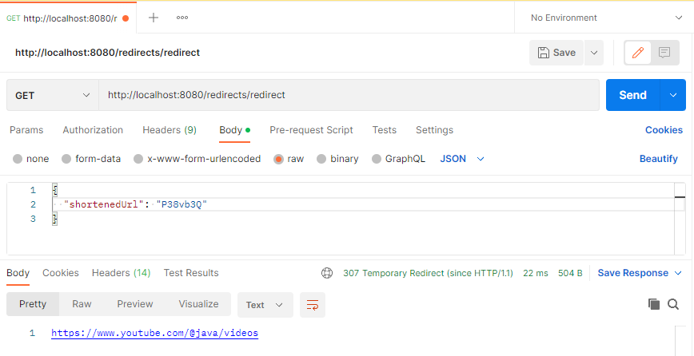

# job4j_url_shortcut

# About

- This application is an URL shortener. Based on the RESTful architecture
- The service can be used by different websites. Each site is given a pair of password and login
- The user sends a POST request with login and password and receives the key
- After the user has registered his site, he can send links to the site and receive converted links
- When a site sends a link with a shorl url, the application returns the associated address and redirection status in
  response
- The service counts the number of calls to each address

***

# Used technologies

<ul>
 <li>JDK 17</li>
 <li>Maven 3.8.5</li>
 <li>Spring Boot 2.7.10</li>
 <li>Spring Web 2.7.10</li>
 <li>Spring Security 2.7.10</li>
 <li>Spring Data JPA 2.7.10</li>
 <li>Spring Validation 2.7.10</li>
 <li>Spring JDBC 2.7.10</li>
 <li>Auth0 3.4.0</li>
 <li>Hibernate 5.6.15.Final</li>
 <li>Lombok 1.18.22</li>
 <li>PostgreSQL 42.2.27</li>
 <li>Liquibase 4.15.0</li>
</ul>

***

# Environment requirements

<ul>
 <li>Create db "url_shortcut". Login: postgres, password: password</li>
 <li>Create .jar file via maven command "mvn package"</li>
 <li>Go to the Target folder and check the presence of "job4j_url_shortcut-1.0-SNAPSHOT.jar" file</li>
 <li>Open the command line, go to the Target folder</li>
 <li>Run this file through "java -jar job4j_url_shortcut-1.0-SNAPSHOT.jar" command</li>
 <li>Run the application in Main class</li>
 <li>Download and install Postman https://www.postman.com/downloads/</li>
 <li>Run commands below in Postman</li>
</ul>

***

# Screenshots

- Website registration: http://localhost:8080/users/sign-up
    - Set POST method
    - Choose "Body", set parameters "raw" and JSON
    - Enter your website in Body:  
      {  
      "site" : "youtube.com"  
      }
    - Copy received username and password
      

- Log in: http://localhost:8080/login
    - POST method
    - Paste the copied username and password to Body
    - Copy highlighted token  
      

- Add token. Choose "Headers", add a new header - key: Authorization, value: copied_token  
  

- Url conversion from long to short: http://localhost:8080/converters/convert-url
    - POST method
    - Enter your url in Body:  
      {  
      "originalUrl": "your_original_url"  
      }
    - Copy received short url  
      

- Url conversion from short to long:
    - GET method
    - Enter the copied short url in Body:  
      {  
      "shortenedUrl": "your_short_url"  
      }  
      

- Get statistics on the number of requests for each link: http://localhost:8080/statistics/common-statistic
    - GET method  
      

***

# Todo list

- Finish "isSignedUp" feature
- Cover the code to unit tests

***

# Contact

Contact me if you have any questions: itfedorovsa@gmail.com

